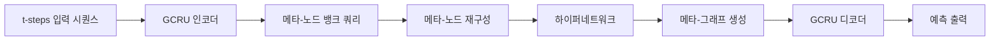

# Spatio-Temporal Meta-Graph Learning for Traffic Forecasting

# 핵심 주장 및 주요 기여 요약

**주장:**  
메타-그래프 학습 기반의 **Meta-Graph Convolutional Recurrent Network (MegaCRN)**을 제안하여 교통 예측에서 공간·시간 이질성(spatio-temporal heterogeneity)과 비정상성(non-stationarity)을 효과적으로 모델링할 수 있음을 입증한다.[1]

**주요 기여:**  
1. **메타-노드 뱅크(Meta-Node Bank)**를 도입하여 노드별 프로토타입을 메모리 네트워크로 학습하고, 이를 기반으로 그래프 구조 학습에 활용함으로써 공간·시간 이질성을 명시적으로 분리·구별할 수 있다.[1]
2. **하이퍼네트워크(Hyper-Network)**를 통해 메타-노드 출력으로부터 노드 임베딩을 생성하고, 이를 그래프 컨볼루션 순환망(GCRN)에 플러그인하여 적응적(adaptive)·순시적(momentary) 그래프를 대체하는 **메타-그래프(meta-graph)**를 구성한다.[1]
3. **벤치마크(METR-LA, PEMS-BAY) 및 대규모 신규 데이터셋(EXPY-TKY)** 에서 기존 최첨단 대비 평균 MAE 2.52→2.52→1.28 등 모든 지표에서 우수한 성능을 달성했으며, 특히 대규모·사건 포함 데이터에서도 메모리 효율적 파라미터(133K개)로 최고 예측력을 보였다.[1]
4. 정성 평가를 통해 **군집화 기반의 시공간 분리**, **사건(사고) 인지에 따른 그래프 적응성**을 시각화하며 일반화 능력을 검증했다.[1]

# 문제 정의 및 제안 방법

## 해결하고자 하는 문제  
일반적인 다변량 시계열 예측(MTS)과 달리, 교통 데이터는  
- 도로 위치·망(topology) 차원에서의 **공간 이질성**  
- 시간대별(출퇴근·사고 등) **비정상성**  
를 내포하며, 이를 사전 정의된 그래프만으로는 충분히 설명·모델링하기 어렵다.[1]

## 메타-그래프 학습 메커니즘  
### 1) GCRU 기반 인코더-디코더  
- **Graph Convolutional Recurrent Unit (GCRU)**: 그래프 컨볼루션 $$G$$와 GRU를 결합한 순환 셀  

$$
    H_t = \text{GCRU}(X_t, P)
  $$
  
  여기서 $$P$$는 그래프 토폴로지를 나타내는 행렬이다.[1]

### 2) 메타-노드 뱅크 & 메모리 읽기  
- **메타-노드 은행** $$M \in \mathbb{R}^{N \times d}$$에 $$d$$차원 학습 가능한 프로토타입 저장  
- 히든 상태 $$h^i_t$$를 쿼리 $$q^i_t = W_Q h^i_t + b_Q$$로 변환  
- 쿼리와 각 메모리 아이템 간 유사도 $$\alpha^{i}_{t,j}$$ 계산 후  

$$
    m^i_t = \sum_{j=1}^N \alpha^{i}_{t,j} M_j
  $$
  
  메모리 값 재구성.[1]

### 3) 하이퍼네트워크로 노드 임베딩 생성  
- 메타-노드 출력을 입력으로 한 FC층 $$\text{NN}_H $$ 를 통해 새로운 노드 임베딩 $$E$$ 생성  

$$
    E = \text{softmax}(\mathrm{ReLU}(\text{NN}_H(M)))
  $$

- 생성된 임베딩으로 메타-그래프 $$P_\text{meta}$$ 구성하여 GCRU에 피드백.[1]

### 4) 학습 손실  
- 예측 MAE에 더해, 메모리 프로토타입 간 **대조 손실** 및 **일관성 손실**을 결합하여  

$$
    \mathcal{L} = \underbrace{\mathrm{MAE}}_{\text{예측}} + \lambda_1 \mathcal{L}_\text{contrast} + \lambda_2 \mathcal{L}_\text{consistency}
  $$
  
  메모리 항목 간 명확한 구분과 응집을 유도한다.[1]

# 모델 구조

- **인코더/디코더**: GCRU  
- **메타-그래프 학습**: 메모리 네트워크 + 하이퍼네트워크 조합  
- **메타-노드 수**: 표준 데이터셋 20개, 대규모 EXPY-TKY 10개  

# 성능 향상 및 한계

**성능 향상:**  
- METR-LA 15분 MAE 2.52 (기존 2.69), PEMS-BAY 1.28 (기존 1.30), EXPY-TKY 5.81 (기존 5.86)로 모든 데이터셋·지표 최고 성능 달성.[1]
- 파라미터 수 133K로 메모리 효율성 확보, 대규모 노드에서도 학습·추론이 안정적.[1]
- 정성 실험: t-SNE 기반 클러스터링으로 도로 링크별 시공간 패턴 분리, 사고 발생 전후 그래프 구조의 역동적 변화 관찰.[1]

**한계:**  
- 메타-노드 수 및 차원, 손실 가중치 등 하이퍼파라미터 민감도 존재.  
- 메모리 네트워크 및 하이퍼네트워크 추가로 학습 수렴에 더 많은 에포크 필요.[1]
- 도로망 정보(정적 0-1 인접행렬) 제공 시 초기에 유리하나, 완전한 비지도 환경에서 초기화 전략 연구 필요.  

# 일반화 성능 향상 관점

- 메타-노드 은행을 통해 **노드 수준의 프로토타입**을 학습함으로써, 사고·이상 상황·다양한 시간대의 패턴을 별도 파라미터 없이 메모리에서 동적으로 재구성 가능하다.  
- **대조 및 일관성 제약**으로 메타-노드 간 응집력·분리도가 강화되어, 학습 데이터에 없는 상황에서도 프로토타입 매칭을 통해 예측 분포를 안정화시킨다.  
- 대규모·이질적 환경(EXPY-TKY)에서 실험을 통해 검증된 바와 같이, 노드 수 증가에도 그래프 동적 적응 및 메모리 기반 일반화 성능이 유지된다.[1]

# 연구 영향 및 향후 고려사항

**영향:**  
- 메모리 강화형 그래프 구조 학습이 교통 예측뿐 아니라 기후·에너지·금융 시계열의 **시공간 이질성** 모델링에 적용 가능성을 제시한다.  
- 비정상 상황(사고·특이 이벤트)에도 강건한 예측 메커니즘으로, 교통 관제·스마트 시티·재난 대응 시스템에 활용 기대.

**향후 고려사항:**  
- **메모리 확장성 연구:** 프로토타입 수·크기 자동 조정, 온라인 업데이트 메커니즘 설계  
- **하이퍼파라미터 민감도 해소:** 메타-그래프 학습률·메모리 손실 가중치 자동 튜닝  
- **다변량 MTS 일반화:** 온·오프라인 학습 시나리오 병합, 도메인 적응 및 이전 학습(Meta-Learning) 적용  
- **정적·동적 토폴로지 융합:** 정적 도로망 정보와 메타-그래프의 융합 전략 모색  
- **실시간 추론 최적화:** 경량화 및 지연시간 최소화 대응  

위와 같은 방향으로 후속 연구를 진행할 때, 본 논문의 메타-그래프 학습 프레임워크가 더욱 폭넓은 시공간 예측 문제에 확장·응용될 수 있을 것이다.

[1](https://ppl-ai-file-upload.s3.amazonaws.com/web/direct-files/attachments/65988149/a1af41cf-fea6-480c-adbb-00a167aee6a6/2211.14701v4.pdf)
