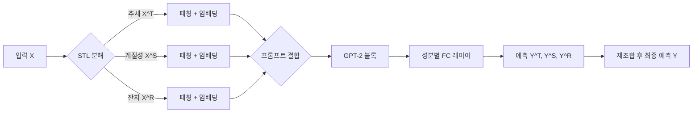

# TEMPO: Prompt-based Generative Pre-trained Transformer for Time Series Forecasting

# 핵심 요약

**주요 주장:** TEMPO는 자연어처리 분야의 GPT와 유사한 사전학습(Generative Pre-trained Transformer) 아키텍처를 시계열 예측에 적용하여, 시계열 고유의 추세(trend), 계절성(seasonality), 잔차(residual)를 분해하고 프롬프트(prompt) 기반 미세조정을 도입함으로써 다양한 도메인의 시계열에 대해 제로샷(zero-shot) 예측 성능을 획기적으로 향상시킨다.[1]

**핵심 기여:**  
- 시계열 입력을 STL 분해로 세 가지 성분(추세, 계절성, 잔차)으로 나누어 각각 임베딩하고, 이들을 프롬프트와 함께 GPT 블록에 투입하는 **구조적 인덕티브 바이어스**를 설계했다.[1]
- 프롬프트 기반 연속 벡터(soft prompt)를 학습하여 다양한 시계열 분포에 적응하도록 함으로써, 사전학습된 언어모델의 일반화 능력을 시계열 예측에 전이했다.[1]
- 제로샷 설정과 다중 모달(텍스트+시계열) 설정 모두에서 최첨단 대비 평균 MAE를 6.5~19.1% 절감하는 등 우수한 예측 성능을 실현하였다.[1]

***

# 문제 정의 및 제안 방법

## 해결하고자 하는 문제  
기존 딥러닝 기반 시계열 예측 모델은 도메인별로 별도 학습이 필요하며, 추세·계절성·잔차처럼 시계열 고유의 패턴을 명시적으로 분리하지 못해 제로샷·다중 도메인 적응력이 부족하다.[1]

## 제안하는 방법  
1. **시계열 분해 (STL decomposition)**  
   입력 $$X\in\mathbb{R}^{n\times L}$$을  

$$
     X_i = X_i^T + X_i^S + X_i^R
   $$  
   
   로 분해하여,  
   - $$X^T$$: 추세 성분  
   - $$X^S$$: 계절성 성분  
   - $$X^R$$: 잔차 성분  
   각각 패치(patching) 및 정규화(normalization) 과정을 거쳐 임베딩한다.[1]

2. **세미-소프트 프롬프트 (Semi-soft Prompt)**  
   추세·계절성·잔차별로 학습 가능한 연속 벡터 $$V_T, V_S, V_R$$를 생성하고,  

$$
     x^T = [V_T; P^T],\quad x^S = [V_S; P^S],\quad x^R = [V_R; P^R]
   $$  
   
   형태로 GPT 블록 입력에 결합한다.[1]

3. **GPT 기반 생성적 사전학습**  
   GPT-2 디코더 블록을 백본으로 사용하며, LoRA(Low-Rank Adaptation)를 통해 파라미터 효율적으로 미세조정한다. 출력 $$\{Z^T,Z^S,Z^R\}$$은 각 성분별 예측 $$Y^T,Y^S,Y^R$$으로 변환 후 재조합된다.[1]

4. **손실 함수**  
   - 예측 손실: $$\mathrm{MSE}(Y,\hat Y)$$  
   - 분해 정합 손실: MSE 기반 재구성 손실 $$\mathcal{L}_{\mathrm{Dec}}$$로 국부 분해가 전역 STL 분해와 일치하도록 유도.[1]

***

# 모델 구조

***

# 성능 향상 및 한계

## 성능 향상  
- **제로샷 장기 예측:** 평균 MAE 6.5~19.1% 절감, 평균 MSE·MAE에서 기존 최고 모델 대비 모두 우위.[1]
- **다중 모달 단기 예측:** 텍스트 요약 컨텍스트를 프롬프트로 결합해 SMAPE 기준 모든 섹터에서 최저값 달성.[1]
- **어블레이션:** 분해 또는 프롬프트 제거 시 성능이 모두 하락, 두 요소의 상호보완적 중요성 확인.[1]

## 한계  
- **수치 추론:** 대형 언어모델의 수치 연산 능력 한계로 인해 복잡한 수치 패턴 예측에 제약이 있다.[1]
- **계산 비용:** 분해·프롬프트 처리로 인한 모델 복잡도 및 학습 시간이 증가한다(추가 분석 필요).  
- **도메인 간 분포 차이:** 프롬프트 풀 설계 및 분해 윈도우 크기 등 하이퍼파라미터 민감도 존재.[1]

***

# 일반화 성능 향상 가능성

TEMPO의 **분해 기반 인덕티브 바이어스**와 **프롬프트 튜닝**은 사전학습된 언어모델의 **제로샷 적응력**을 시계열에 전이시킨다.  
- 분해된 성분별로 예측 과제를 단순화해 주파수 도메인 예측 난이도를 경감시키고[섹션 G],  
- 프롬프트는 시계열 분포 이동(distribution shift)에 유연하게 적응하도록 돕는다.  
이로써 미지의 데이터셋에 대한 일반화 성능이 획기적으로 개선된다.[1]

***

# 향후 연구 방향 및 고려 사항

1. **대형 언어모델 통합:** GPT-4급 이상의 모델을 활용해 수치 추론 능력 강화 검토.  
2. **프롬프트 풀 최적화:** 동적·메타러닝 기반 프롬프트 선택 메커니즘 연구.  
3. **융합 학습 전략:** 자기 지도(self-supervised) 학습과 결합하여 전이 학습 범위 확장.  
4. **실시간 분포 적응:** 온라인 분해 윈도우 및 프롬프트 업데이트로 비정상(non-stationary) 데이터 적합성 향상.  
5. **경량화 및 효율화:** 분해·프롬프트 모듈 경량화로 실제 시스템 적용 시 지연 최소화.

[1](https://ppl-ai-file-upload.s3.amazonaws.com/web/direct-files/attachments/65988149/8971f036-908f-4e94-a19c-d1cd3b4d3ac4/2310.04948v3.pdf)
