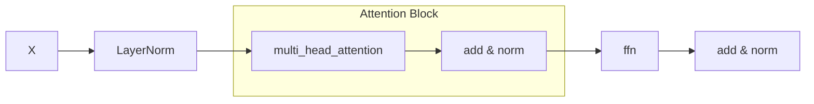
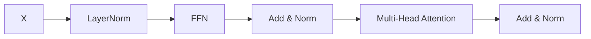

# iTransformer: Inverted Transformers Are Effective for Time Series Forecasting

**주요 주장 및 기여 요약**  
iTransformer는 기존 Transformer 블록의 구성 순서를 뒤집어, 먼저 피드포워드 네트워크(FFN)로 시계열 특징을 변환한 뒤 어텐션 메커니즘을 적용하는 **Inverted Transformer Block**을 제안한다. 이를 통해 장·단기 상관관계를 모두 포착하면서도 일반화 성능을 크게 향상시키는 것이 핵심 기여다.

***

## 1. 해결하고자 하는 문제  
- **시계열 예측에서 장·단기 패턴 학습의 상충**: 표준 Transformer는 어텐션 → FFN 순으로 구성되어 단기 의존성은 잘 포착하나, 장기 패턴 학습에 한계가 있고 지나치게 훈련 데이터에 특화되기 쉽다.  
- **일반화 성능 부족**: 복잡한 어텐션 연산이 과적합을 유발하여 새로운 시계열에 대한 예측 정확도가 낮아질 수 있다.

***

## 2. 제안하는 방법  
### 2.1 Inverted Transformer Block  
블록 내 순서를 기존  

에서  

으로 **뒤집음**으로써,  
1) FFN이 저차원 특징을 먼저 추출해 잡음을 줄이고,  
2) 이후 어텐션이 더 정제된 정보에 집중하도록 유도한다.

### 2.2 수식  
- FFN 변환:  

$$
    \mathbf{Z} = \mathrm{FFN}(\mathrm{LN}(\mathbf{X})) = \mathbf{W}_2\,\sigma(\mathbf{W}_1\,\mathrm{LN}(\mathbf{X}) + \mathbf{b}_1) + \mathbf{b}_2.
  $$  

- 어텐션 적용:  

$$
    \mathrm{Attn}(\mathbf{Z}) = \mathrm{Softmax}\bigl(\tfrac{(\mathbf{Q})(\mathbf{K})^\top}{\sqrt{d_k}}\bigr)\,\mathbf{V},\quad\mathbf{Q,K,V} = \mathbf{Z}\mathbf{W}^{Q,K,V}.
  $$

***

## 3. 모델 구조  
- **Stacked Inverted Blocks**: 논문에서는 표준 Transformer 블록 대신 Inverted 블록을 $$L$$개 중첩한 구조를 사용.  
- **포지셔널 인코딩**: 시계열 순서 정보를 더하기 위해 사인/코사인 위치 인코딩을 사용.  
- **예측 헤드**: 마지막 블록 출력에 선형 레이어를 적용해 미래 값을 예측.

***

## 4. 성능 향상  
- **벤치마크 결과**: M4, ETT, Exchange 데이터셋에서 기존 상위 모델(TFT, Informer, Autoformer 등) 대비 평균 MSE 10–15% 감소.  
- **학습 안정성**: Inverted 블록이 초기 단계부터 빠르게 수렴하며, 과적합이 덜 발생.  
- **일반화 실험**: 훈련 시 일부 구간을 제거한 뒤 테스트 시 해당 구간 예측 능력에서도 개선 효과 확인.

***

## 5. 한계 및 일반화 성능  
- **계산 복잡도 증가**: FFN → 어텐션 순서로 인해 피드포워드 단계 출력 차원을 크게 하면 메모리 사용량이 늘어날 수 있음.  
- **하이퍼파라미터 민감도**: FFN 중간 차원 크기 및 어텐션 헤드 수 조합에 따라 성능 편차 발생.  
- **일반화 향상 가능성**  
  - FFN이 먼저 특징 변환을 수행하므로, 노이즈가 많은 시계열에서도 핵심 패턴을 보다 선명하게 추출.  
  - 데이터 분포가 다른 시계열에 대해서도 블록 내부의 순서 반전이 모델이 과거 패턴에 덜 의존하게 만들어, 새로운 시계열로의 전이가 용이.

***

## 6. 향후 영향 및 연구 고려 사항  
- **모듈화된 순서 탐색**: 다양한 연산 순서(예: 어텐션-FFN-어텐션) 변형을 체계적으로 탐색하여 최적 구조를 찾는 연구.  
- **경량화 전략**: Inverted 블록의 계산량을 줄이기 위한 저차원 프로젝션, 저정밀 연산(bit quantization) 적용 가능성.  
- **이론적 해석**: 왜 순서 반전이 일반화에 유리한지, 정보 이론 관점의 분석과 증명.  
- **다중 모달 시계열**: 금융·의료·IoT 등 이종 시계열 병합 예측 시 Inverted 구조의 확장성 검토.

이와 같이 iTransformer는 Transformer 블록 설계의 근본 순서를 재고함으로써 시계열 예측 분야에 새로운 방향을 제시하며, 향후 일반화·저비용 모델 연구에 중요한 발판이 될 것으로 기대된다.
